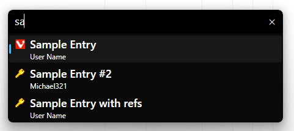
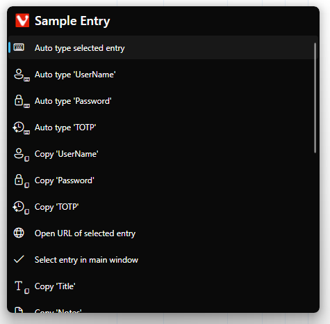
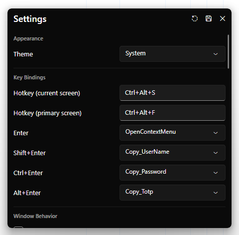

# FluentPassFinder

[](https://github.com/yusei36/FluentPassFinder) [](https://github.com/yusei36/FluentPassFinder/releases/latest) [](https://github.com/yusei36/FluentPassFinder/releases/latest)

**[Download](https://github.com/yusei36/FluentPassFinder/releases/latest)** | **[Installation](#installation)** | **[How to use](#how-to-use)** | **[Configuration](#configuration)**

A KeePass plugin with a Fluent Design search window to quickly find entries and autotype or copy passwords and other fields. A global shortcut opens the search window from anywhere, and you can create new entries without switching back to KeePass.



## Requirements
- [KeePass](https://keepass.info/) 2.54 or later
- Windows 10 or 11

A Linux/macOS port should be feasible but isn't implemented yet. If you'd like to help build and test it, see [docs/CrossPlatform.md](docs/CrossPlatform.md).

## Installation

1. Download `FluentPassFinder-<version>.zip` from the [releases page](https://github.com/yusei36/FluentPassFinder/releases/latest) and extract it.
2. Copy the `FluentPassFinderPlugin` folder into your KeePass `Plugins` folder (e.g. `C:\Program Files\KeePass Password Safe 2\Plugins\`).
3. (Re)start KeePass.
4. Open a database, then press the hotkey (default `Ctrl+Alt+S`) to launch the search window.

## How it works

The search window runs as a **separate process** from KeePass, built with [Avalonia](https://avaloniaui.net/). The KeePass plugin hosts a named-pipe server and spawns the app; all KeePass operations (search, copy, autotype, settings) are routed back over the pipe:

```
         Global hotkey
              ↓
      FluentPassFinder.exe   (Avalonia search window, .NET 10)
              ↓  (Named pipe JSON)
    FluentPassFinder.dll     (KeePass plugin, .NET Framework 4.8)
              ↓  (KeePass API)
       KeePass Database
```

## How to use

### Global hotkeys

These work system-wide, from any application (configurable in the settings panel):

- Open on current screen: `Ctrl+Alt+S` (or `Alt Gr+S`)
- Open on primary screen: `Ctrl+Alt+F` (or `Alt Gr+F`)
- Open with new-entry form: `Ctrl+Alt+N` (or `Alt Gr+N`)

### In the search window

- Navigate result list: `Arrow Up` / `Arrow Down`
- Open new-entry form: `Ctrl+N`
- Save changes (settings or a new entry): `Ctrl+S`
- Close (or step back from a context menu / panel): `Esc`
- Move window: hold `Ctrl` and drag it
- Resize window: hold `Ctrl` and drag from its right or bottom edge

### Entry actions

With an entry selected in the list:

- Open entry context menu: `Enter`
- Copy user name: `Shift+Enter`
- Copy password: `Ctrl+Enter`
- Copy TOTP: `Alt+Enter`

`Shift+Enter` / `Ctrl+Enter` / `Alt+Enter` are the defaults and can be reassigned in the settings panel.

### Command-line activation

Running `FluentPassFinder.exe` directly (e.g. from a desktop shortcut, the Start menu, or a stream-deck/macro tool) drives the already-running instance that KeePass started, so you can trigger it from launchers that can't bind a global hotkey. Each flag mirrors one of the global hotkeys:

| Command | Action |
|---|---|
| `FluentPassFinder.exe` | Open on current screen (default) |
| `FluentPassFinder.exe --current` | Open on current screen |
| `FluentPassFinder.exe --primary` | Open on primary screen |
| `FluentPassFinder.exe --new-entry` | Open with the new-entry form |

If KeePass (and therefore FluentPassFinder) isn't running, a message box explains that it must be started from KeePass first.


## Screenshots
### Search Window


### Entry context menu


### Settings



## Configuration

Plugin settings can be changed via the built-in **settings panel** inside the FluentPassFinder window (gear icon), and are applied immediately without restarting KeePass. Press `Ctrl+S` to save. The settings are persisted as JSON under the `FluentPassFinder` key in `KeePass.config.xml`, which you can also edit directly if you prefer.

The panel covers:

- **Theme**: follow the system theme, or force light/dark.
- **Search**: which entry fields are searched (title, user name, URL, notes, tags, custom fields, ...), whether expired entries and groups excluded from KeePass searching are skipped, and whether field references are resolved.
- **Actions**: reassign the `Shift+Enter` / `Ctrl+Enter` / `Alt+Enter` shortcuts and reorder the per-entry actions.
- **Hotkeys**: the three global hotkeys (current screen, primary screen, new entry).
- **New entries**: which group new entries are saved into.
- **Window**: width, results-area height, and screen anchor (e.g. center, bottom-center) plus an X/Y offset. You can also set the size and position directly by `Ctrl`-dragging the window while the settings panel is open; the new placement is mirrored into these fields so saving keeps it.
- **Behavior**: optionally preserve the last search text for a configurable timeout, and whether `Esc` always closes the window instead of stepping back.
- **TOTP placeholder**: see below.

### New entries

Press `Ctrl+Alt+N` (global) or `Ctrl+N` (in the window) to open a form that creates a new entry in the open database without leaving FluentPassFinder. New entries are saved into a dedicated group (auto-created as **"New entries"** on first use); you can change the target group in settings.

### TOTP placeholder

The **TOTP placeholder** setting controls how time-based one-time passwords are resolved. It defaults to KeePass's built-in `{TIMEOTP}`, but you can change it to the placeholder used by another TOTP plugin (for example KeePassOTP's `{KPOTP}`) so FluentPassFinder resolves codes through that plugin instead.

> [!WARNING]
> Do not set the TOTP placeholder to a counter-based OTP placeholder such as `{HMACOTP}`. It is not blocked and the code will resolve, but HOTP is counter-based: KeePass increments and saves the entry's counter every time the placeholder is resolved. FluentPassFinder resolves it just to decide whether to *offer* the TOTP action, so simply browsing entries would advance the counter (and mark the database modified) without you ever using a code, desyncing it from the server.

## Building

### Prerequisites

| Requirement | Notes |
|---|---|
| .NET 10 SDK | For the Avalonia app (`FluentPassFinder`) |
| .NET Framework 4.8 SDK | For the KeePass plugin (`FluentPassFinderPlugin`) |
| KeePass.exe (2.54+, compile reference) | Place at `build\KeePass\KeePass.exe`. If absent, the plugin falls back to the (unsigned) `KeePass` NuGet package. |

```powershell
dotnet restore
dotnet build --no-restore
```

After building the plugin, a post-build target copies the plugin and app into `build\KeePass\Plugins\FluentPassFinder\` for local testing.

### Packaging

`scripts\Publish-Package.ps1` produces the distributable zip (merges plugin DLLs with ILRepack, publishes the app as a single-file executable):

```powershell
.\scripts\Publish-Package.ps1
```

## Project structure

```
src/
  FluentPassFinderContracts    Shared DTOs, interfaces, and named-pipe IPC protocol (net48 + net10.0)
  FluentPassFinderPlugin       KeePass plugin entry point; hosts the pipe server (net48)
  FluentPassFinder             Standalone Avalonia search window; pipe client (net10.0)
scripts/
  Publish-Package.ps1          Build Release and produce the distributable zip
```

## License

Copyright © 2023 - 2026 Uwe Kögel

This program is free software: you can redistribute it and/or modify
it under the terms of the GNU General Public License as published by
the Free Software Foundation, either version 3 of the License, or
(at your option) any later version.

This program is distributed in the hope that it will be useful,
but WITHOUT ANY WARRANTY; without even the implied warranty of
MERCHANTABILITY or FITNESS FOR A PARTICULAR PURPOSE. See the
GNU General Public License for more details.

You should have received a copy of the GNU General Public License
along with this program. If not, see <https://www.gnu.org/licenses/>.

See [LICENSE](LICENSE) for the full license text.
